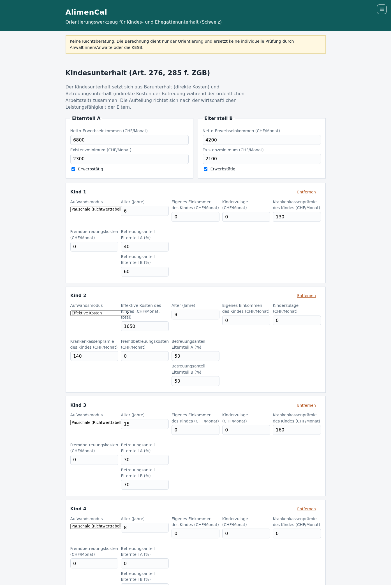

# AlimenCal

**AlimenCal** ist ein mehrsprachiges Orientierungswerkzeug (Web-App) für
Unterhaltsfragen bei Trennung und Scheidung in der Schweiz:

- **Kindesunterhalt** (Art. 276, 285 f. ZGB) mit Barunterhalt und
  Betreuungsunterhalt (revidiertes Unterhaltsrecht, in Kraft seit 1. Januar 2017);
  der Grundbedarf kann je Kind pauschal (Richtwerttabelle) oder über die
  effektiven Kosten des Kindes ermittelt werden
- **Ehegattenunterhalt** (Art. 176 ZGB bei Getrenntleben; Art. 125 ZGB
  nachehelich) nach der zweistufig-konkreten Methode (BGE 140 III 337) mit
  Überschussverteilung inklusive Mankoverteilung (BGE 135 III 66)
- **Kostentrennung vor der Scheidung**: Stichtag definieren, Bankexport (CSV
  oder ISO-20022-XML/camt.052–054)
  hochladen, Transaktionen zuordnen (ignorieren / anteilsmässig / voll durch
  eine Partei) – mit automatischem Ausgleich



## QuickStart

AlimenCal ist eine rein statische Web-App (HTML/CSS/Vanilla JS) – keine
Installation, kein Server, keine Abhängigkeiten.

1. Repository klonen (oder auf GitHub **Code → Download ZIP** wählen und entpacken):

   ```bash
   git clone https://github.com/michaelleuzinger/AlimenCal.git
   cd AlimenCal
   ```

2. `index.html` per Doppelklick im Browser öffnen (Chrome, Firefox, Edge …) –
   die App läuft direkt über `file://`.

3. Über das Hamburger-Menü oben rechts allenfalls unter **Richtwerte** das
   kantonale Preset laden (z. B. Zürcher Kinderkosten-Tabelle 1.3.2025),
   dann im Tab **Kindesunterhalt** mit der Erfassung beginnen.

Alle Eingaben werden automatisch lokal im Browser (localStorage) gespeichert.
Optional kann die App statt über `file://` auch über einen lokalen Webserver
oder beliebiges statisches Hosting (z. B. GitHub Pages) bereitgestellt werden.

## Eigenschaften

- **Responsive Darstellung**: Die App passt sich an Smartphone-, Tablet- und  Desktop-Bildschirme an – Grids brechen um, Tabellen und Tab-Navigation  sind auf schmalen Displays horizontal scrollbar, Touch-Ziele sind  vergrössert
- **Vier Sprachen**: Deutsch, Français, Italiano, English – umschaltbar,
  Auswahl wird lokal gespeichert
- **Konfigurierbare Richtwerte**: Existenzminima, altersgestaffelte
  Grundbedarfe und Betreuungsunterhalts-Richtwerte; speicherbar im Browser
  (localStorage), exportier- und importierbar als JSON
- **Kantonale Presets**: JSON-Dateien unter `presets/`, in der App auswählbar
  (z. B. Zürcher Kinderkosten-Tabelle 1.3.2025)
- **Kostentrennung**: Bankexport-Upload mit automatischer Erkennung von
  Trennzeichen, Datums- und Betragsformaten; je Transaktion ignorieren,
  anteilsmässig aufteilen (Anteil konfigurierbar) oder voll einer Partei
  zuordnen; Sammelaktionen für die Erstzuordnung
- **Themes**: vordefinierte Designs (Classic, Dark, High Contrast, Warm, Blue)
  und ein Theme-Editor, mit dem alle Farben (inklusive Bannerfarbe) und der
  Eckenradius frei anpassbar sind; Auswahl wird lokal gespeichert
- **Persistenz**: alle Eingaben (inkl. Kinderliste, Kostentrennung mit
  Bankexport und Zuordnungen) werden automatisch gespeichert und nach einem
  Browser-Neustart wiederhergestellt – keine Daten gehen verloren
- **Nach Updates lesbar**: versioniertes Speicherformat (`js/storage.js`) mit
  Migration und Sanitizing – nach einem App-Update werden vorhandene
  Eingaben in jedem Fall wieder gelesen; Altbestände werden beim Start
  migriert (Regel in AGENTS.md, «Lesbarkeit der Nutzerdaten nach Updates»)
- **Austausch zwischen Parteien**: Jede Partei erfasst nur ihre eigenen Daten
  auf ihrem PC, exportiert sie als JSON-Datei und stellt sie der anderen Partei
  zu; der Import übernimmt nur die enthaltenen Abschnitte (Merge) – eigene
  Eingaben bleiben unverändert
- **Verschlüsselter Export (Public-Key)**: Der Austausch-Export kann mit dem
  öffentlichen Schlüssel der Gegenseite verschlüsselt werden (ECDH P-256 +
  AES-GCM, Web Crypto) – nur die Gegenseite kann die Datei öffnen
- **Mangellagen-Erkennung**: Unterdeckung (Manko) wird ausgewiesen, inklusive
  Hinweis auf die Nachforderungspraxis
- **Kein Server, keine Abhängigkeiten**: reine statische Web-App
  (HTML/CSS/Vanilla JS), alle Daten bleiben lokal im Browser

## Nutzung

1. `index.html` im Browser öffnen (beliebiger Hosting-Ordner genügt,
   z. B. GitHub Pages) – oder die Datei direkt per `file://` starten.
2. Tab **Kindesunterhalt**: Einkommen und Existenzminima der Eltern erfassen,
   Kinder hinzufügen (Alter, eigene Einkünfte, Kinderzulagen,
   Krankenkassenprämie, Fremdbetreuungskosten, Betreuungsanteile); je Kind
   wählbar: Grundbedarf pauschal (Richtwerttabelle) oder effektive Kosten.
3. Tab **Ehegattenunterhalt**: falls gewünscht aktivieren, Angaben zu
   gebührendem Lebensstandard, Mehrkosten und Leistungsfähigkeit erfassen.
4. Tab **Kostentrennung**: Stichtag wählen, Bankexport (CSV oder camt-XML)
   hochladen,
   Kontoinhaber angeben, Transaktionen zuordnen – die App errechnet den
   Ausgleich. Details: [docs/KOSTENTRENNUNG.md](docs/KOSTENTRENNUNG.md)
5. Tab **Austausch**: eigene Daten als JSON exportieren, Datei der
   anderen Partei importieren (Merge).
6. Über das Hamburger-Menü oben rechts im Kopf: Sprachwahl sowie unter
   **Richtwerte** kantonale Werte anpassen, speichern,
   exportieren/importieren, Presets laden, und unter **Themes** Design
   wählen oder im Theme-Editor Farben anpassen.

Ausführliche Anleitung: [docs/BENUTZERHANDBUCH.md](docs/BENUTZERHANDBUCH.md)

## Dokumentation

| Dokument | Inhalt |
|---|---|
| [docs/BENUTZERHANDBUCH.md](docs/BENUTZERHANDBUCH.md) | Schritt-für-Schritt-Anleitung aller Tabs |
| [docs/KALKULATION.md](docs/KALKULATION.md) | Berechnungslogik Kindes- und Ehegattenunterhalt |
| [docs/KOSTENTRENNUNG.md](docs/KOSTENTRENNUNG.md) | Modul Kostentrennung: CSV- und camt-XML-Import, Zuordnung, Ausgleich |
| [docs/RECHTLICHE-GRUNDLAGEN.md](docs/RECHTLICHE-GRUNDLAGEN.md) | Rechtsquellen, Rechtsprechung, kantonale Praxis, Disclaimer |

## Kantonale Presets

Unter `presets/` liegen kantonsbezogene Richtwertsätze als JSON, auswählbar im
Tab **Richtwerte**:

- `zuerich-2025.json` – Zürcher Kinderkosten-Tabelle vom 1. März 2025
  (Referenz, identisch mit App-Default)
- `schaffhausen-offen.json` – **Platzhalter mit Verifikations-Checkliste**:
  Der Kanton Schaffhausen hat keine publizierte Tabelle; die effektiven
  Ansätze von KESB/Kantonsgericht Schaffhausen MÜSSEN vor Verwendung erhoben
  und eingetragen werden (die Checkliste nennt KESB-Kontakt, Gebühren, Quellen).

Jedes Preset enthält `meta` (Name, Kanton, Quelle, URL, Hinweise,
Verifikations-Checkliste) und die Wertfelder. `js/presets.js` hält eine
eingebettete Kopie bereit, damit die App auch ohne Webserver via `file://`
funktioniert; `tests/presets.test.js` prüft die Konsistenz zwischen beiden.

## Tests

```bash
node tests/calculator.test.js   # Berechnungskern (53 Tests)
node tests/presets.test.js      # Presets: JSON-Gültigkeit, Konsistenz JS/JSON (29 Tests)
node tests/costsplit.test.js    # Kostentrennung: CSV- und camt-XML-Parsing, Zuordnung, Ausgleich (54 Tests)
node tests/themes.test.js       # Themes: Presets, Token, Validierung, Sanitizing (123 Tests)
node tests/casedata.test.js     # Falldaten-Austausch: Validierung, Merge, Roundtrip (43 Tests)
node tests/settings.test.js    # Verbindliche Einstellungen: Two-Party-Lock, Override-Modus, Read-Only-Imports (21 Tests)
node tests/crypto.test.js      # Serverlose Verbindlichkeit: Hash-Kette, signierte Lock-Dateien (15 Tests)
node tests/casecrypto.test.js  # Verschlüsselter Austausch: ECDH/AES-GCM-Export (14 Tests)
node tests/storage.test.js    # localStorage-Persistenz: Versionierung, Migration, Sanitizing (35 Tests)
```

Geprüft werden u. a. Grundbedarfstabellen, Aufteilung nach wirtschaftlicher
Leistungsfähigkeit, Mangellagen-Deckelung, die Überschuss- und Mankomethode
des Ehegattenunterhalts sowie CSV-Parsing und Ausgleichslogik; die
Berechnungslogik im Detail: [docs/KALKULATION.md](docs/KALKULATION.md).

## Verwendete Richtwerte (Default)

Die Default-Richtwerte (Stand: März 2025) basieren auf der Zürcher
Kinderkosten-Tabelle vom 1. März 2025, abzüglich der enthaltenen pauschalen
Kinder-Krankenkassenprämie (CHF 130, da die effektive Prämie separat erfasst
wird), sowie auf betreibungsrechtlichen Existenzminima (Art. 93 SchKG) als
Orientierung. Die vollständige Wertetabelle mit Quellen steht in
[docs/KALKULATION.md](docs/KALKULATION.md); zur Rechtslage seit
**BGer 147 III 265** (zweistufig-konkrete Methode verbindlich, Zürcher Tabelle
per 2026 nicht mehr weitergeführt) und zur Praxis im Kanton Schaffhausen
(keine publizierte Tabelle, Verifikation über die KESB zwingend) siehe
[docs/RECHTLICHE-GRUNDLAGEN.md](docs/RECHTLICHE-GRUNDLAGEN.md).

## Rechtlicher Hinweis (Disclaimer)

AlimenCal ist **keine Rechtsberatung** und liefert keine verbindlichen
Resultate. Die Berechnung dient ausschliesslich der ersten Orientierung.
Massgebend sind stets die konkreten Umstände des Einzelfalls sowie die Praxis
der zuständigen Gerichte und der Kindes- und Erwachsenenschutzbehörde (KESB).
Die mitgelieferten Richtwerte sind typische Orientierungswerte und müssen vor
jedem produktiven Einsatz an die massgebliche kantonale Praxis (z. B.
KESB/Kantonsgericht Schaffhausen) angepasst und verifiziert werden. Details:
[docs/RECHTLICHE-GRUNDLAGEN.md](docs/RECHTLICHE-GRUNDLAGEN.md).

## Roadmap

- [x] Kantonal vorkonfigurierte Richtwertsätze (Presets ZH / SH-Platzhalter)
- [x] Kostentrennung vor der Scheidung (Stichtag, Bankexport CSV/camt-XML, Ausgleich)
- [x] Themes mit Theme-Editor (vordefinierte Designs, freie Farbanpassung)
- [x] Persistenz aller Eingaben über Browser-Neustarts
- [x] Austausch zwischen Parteien (Export/Import mit Merge, serverlos)
- [x] Verbindliche Einstellungen: Two-Party-Lock, Override-Modus, Read-Only-Imports ([docs/settings-binding-override.md](docs/settings-binding-override.md))
- [x] Serverlose Verbindlichkeit: Hash-Kette und beidseitig signierte Lock-Dateien (Web Crypto, ohne Server)
- [x] Public-Key-verschlüsselter Austausch (ECDH P-256 + AES-GCM)
- [ ] PDF-Export des Berechnungsblatts
- [ ] BVG-/Vorsorgeabzüge und steuerliche Saldierung
- [ ] Alimentenindexierung (Art. 129 ZGB)
