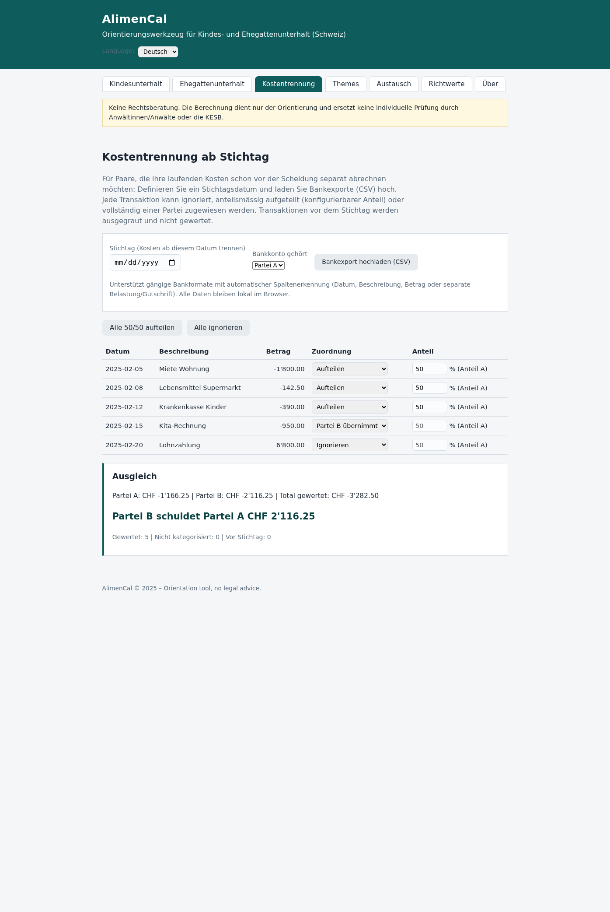

# AlimenCal

**AlimenCal** ist ein mehrsprachiges Orientierungswerkzeug (Web-App) für
Unterhaltsfragen bei Trennung und Scheidung in der Schweiz:

- **Kindesunterhalt** (Art. 276, 285 f. ZGB) mit Barunterhalt und
  Betreuungsunterhalt (revidiertes Unterhaltsrecht, in Kraft seit 1. Januar 2017);
  der Grundbedarf kann je Kind pauschal (Richtwerttabelle) oder über die
  effektiven Kosten des Kindes ermittelt werden
- **Ehegattenunterhalt** (Art. 176 ZGB bei Getrenntleben; Art. 125 ZGB
  nachehelich) nach der zweistufig-konkreten Methode (BGE 140 III 337) mit
  Überschussverteilung inklusive Mankoverteilung (BGE 135 III 66)
- **Kostentrennung vor der Scheidung**: Stichtag definieren, Bankexport (CSV)
  hochladen, Transaktionen zuordnen (ignorieren / anteilsmässig / voll durch
  eine Partei) – mit automatischem Ausgleich




## Eigenschaften

- **Vier Sprachen**: Deutsch, Français, Italiano, English – umschaltbar,
  Auswahl wird lokal gespeichert
- **Konfigurierbare Richtwerte**: Existenzminima, altersgestaffelte
  Grundbedarfe und Betreuungsunterhalts-Richtwerte; speicherbar im Browser
  (localStorage), exportier- und importierbar als JSON
- **Kantonale Presets**: JSON-Dateien unter `presets/`, in der App auswählbar
  (z. B. Zürcher Kinderkosten-Tabelle 1.3.2025)
- **Kostentrennung**: Bankexport-Upload mit automatischer Erkennung von
  Trennzeichen, Datums- und Betragsformaten; je Transaktion ignorieren,
  anteilsmässig aufteilen (Anteil konfigurierbar) oder voll einer Partei
  zuordnen; Sammelaktionen für die Erstzuordnung
- **Themes**: vordefinierte Designs (Classic, Dark, High Contrast, Warm, Blue)
  und ein Theme-Editor, mit dem alle Farben und der Eckenradius frei anpassbar
  sind; Auswahl wird lokal gespeichert
- **Persistenz**: alle Eingaben (inkl. Kinderliste, Kostentrennung mit
  Bankexport und Zuordnungen) werden automatisch gespeichert und nach einem
  Browser-Neustart wiederhergestellt – keine Daten gehen verloren
- **Austausch zwischen Parteien**: Jede Partei erfasst nur ihre eigenen Daten
  auf ihrem PC, exportiert sie als JSON-Datei und stellt sie der Gegenpartei
  zu; der Import übernimmt nur die enthaltenen Abschnitte (Merge) – eigene
  Eingaben bleiben unverändert
- **Mangellagen-Erkennung**: Unterdeckung (Manko) wird ausgewiesen, inklusive
  Hinweis auf die Nachforderungspraxis
- **Kein Server, keine Abhängigkeiten**: reine statische Web-App
  (HTML/CSS/Vanilla JS), alle Daten bleiben lokal im Browser

## Nutzung

1. `index.html` im Browser öffnen (beliebiger Hosting-Ordner genügt,
   z. B. GitHub Pages) – oder die Datei direkt per `file://` starten.
2. Tab **Kindesunterhalt**: Einkommen und Existenzminima der Eltern erfassen,
   Kinder hinzufügen (Alter, eigene Einkünfte, Kinderzulagen,
   Krankenkassenprämie, Fremdbetreuungskosten, Betreuungsanteile); je Kind
   wählbar: Grundbedarf pauschal (Richtwerttabelle) oder effektive Kosten.
3. Tab **Ehegattenunterhalt**: falls gewünscht aktivieren, Angaben zu
   gebührendem Lebensstandard, Mehrkosten und Leistungsfähigkeit erfassen.
4. Tab **Kostentrennung**: Stichtag wählen, Bankexport (CSV) hochladen,
   Kontoinhaber angeben, Transaktionen zuordnen – die App errechnet den
   Ausgleich. Details: [docs/KOSTENTRENNUNG.md](docs/KOSTENTRENNUNG.md)
5. Tab **Themes**: Design wählen oder im Theme-Editor Farben anpassen.
6. Tab **Richtwerte**: kantonale Werte anpassen, speichern,
   exportieren/importieren, Presets laden.
7. Tab **Austausch**: eigene Daten als JSON exportieren, Datei der
   Gegenpartei importieren (Merge).

Ausführliche Anleitung: [docs/BENUTZERHANDBUCH.md](docs/BENUTZERHANDBUCH.md)

## Doku aktuell halten (verbindliche Regel)

Bei **jeder** Änderung an Code, Richtwerten, Presets, UI, i18n oder Tests sind
Doku und README im selben Change nachzuführen – ein Change ohne Doku-Nachführung
gilt als unvollständig. Details, Zuordnungstabelle und Merge-Checkliste:
[AGENTS.md](AGENTS.md).

## Dokumentation

| Dokument | Inhalt |
|---|---|
| [docs/BENUTZERHANDBUCH.md](docs/BENUTZERHANDBUCH.md) | Schritt-für-Schritt-Anleitung aller Tabs |
| [docs/KALKULATION.md](docs/KALKULATION.md) | Berechnungslogik Kindes- und Ehegattenunterhalt |
| [docs/KOSTENTRENNUNG.md](docs/KOSTENTRENNUNG.md) | Modul Kostentrennung: CSV-Import, Zuordnung, Ausgleich |
| [docs/RECHTLICHE-GRUNDLAGEN.md](docs/RECHTLICHE-GRUNDLAGEN.md) | Rechtsquellen, Rechtsprechung, kantonale Praxis, Disclaimer |

## Screenshots

| Screenshot | Inhalt |
|---|---|
| `screenshots/01-kindesunterhalt-de.png` | Kindesunterhalt (Deutsch) |
| `screenshots/02-ehegattenunterhalt-de.png` | Ehegattenunterhalt (Deutsch) |
| `screenshots/03-richtwerte-de.png` | Richtwerte mit Preset-Auswahl (Deutsch) |
| `screenshots/04-pension-enfants-fr.png` | Pension alimentaire (Français) |
| `screenshots/05-informazioni-it.png` | Informazioni (Italiano) |
| `screenshots/06-child-maintenance-en.png` | Child maintenance (English) |
| `screenshots/07-kostentrennung-de.png` | Kostentrennung mit Bankexport (Deutsch) |
| `screenshots/08-themes-classic-de.png` | Themes mit Theme-Editor, Classic (Deutsch) |
| `screenshots/09-themes-dark-de.png` | Themes, Dark-Theme (Deutsch) |
| `screenshots/10-austausch-de.png` | Austausch-Tab mit Export/Import (Deutsch) |

## Kantonale Presets

Unter `presets/` liegen kantonsbezogene Richtwertsätze als JSON, auswählbar im
Tab **Richtwerte**:

- `zuerich-2025.json` – Zürcher Kinderkosten-Tabelle vom 1. März 2025
  (Referenz, identisch mit App-Default)
- `schaffhausen-offen.json` – **Platzhalter mit Verifikations-Checkliste**:
  Der Kanton Schaffhausen hat keine publizierte Tabelle; die effektiven
  Ansätze von KESB/Kantonsgericht Schaffhausen MÜSSEN vor Verwendung erhoben
  und eingetragen werden (die Checkliste nennt KESB-Kontakt, Gebühren, Quellen).

Jedes Preset enthält `meta` (Name, Kanton, Quelle, URL, Hinweise,
Verifikations-Checkliste) und die Wertfelder. `js/presets.js` hält eine
eingebettete Kopie bereit, damit die App auch ohne Webserver via `file://`
funktioniert; `tests/presets.test.js` prüft die Konsistenz zwischen beiden.

## Tests

```bash
node tests/calculator.test.js   # Berechnungskern (53 Tests)
node tests/presets.test.js      # Presets: JSON-Gültigkeit, Konsistenz JS/JSON (29 Tests)
node tests/costsplit.test.js    # Kostentrennung: CSV-Parsing, Zuordnung, Ausgleich (42 Tests)
node tests/themes.test.js       # Themes: Presets, Token, Validierung, Sanitizing (113 Tests)
node tests/casedata.test.js     # Falldaten-Austausch: Validierung, Merge, Roundtrip (38 Tests)
```

Prüft u. a.: Grundbedarfstabellen, Aufteilung nach wirtschaftlicher
Leistungsfähigkeit, netto-Verrechnung des Betreuungsunterhalts (kein Saldo
bei 50/50), Mangellagen-Deckelung auf das frei verfügbare Einkommen,
Mehrkindberechnungen, die Überschuss- und Mankomethode des
Ehegattenunterhalts sowie CSV-Parsing und Ausgleichslogik der Kostentrennung.

## Struktur

```
index.html          UI (Tabs: Kindesunterhalt, Ehegattenunterhalt, Kostentrennung, Themes, Austausch, Richtwerte)
css/style.css       Styles
js/calculator.js    Berechnungskern (DOM-frei, auch in Node.js lauffähig)
js/costsplit.js     Kostentrennung: CSV-Import, Zuordnung, Ausgleich (DOM-frei)
js/themes.js       Theme-Definitionen und -Validierung (DOM-frei, auch in Node.js lauffähig)
js/casedata.js     Falldaten-Austausch: Validierung und Merge (DOM-frei)
js/config.js        Default-Richtwerte (Zürcher Kinderkosten-Tabelle 1.3.2025)
js/presets.js       Eingebettete Kopie der kantonalen Presets (file://-fähig)
presets/*.json      Kantonale Richtwertsätze inkl. Quellen und Checklisten
js/app.js           UI-Logik, i18n-Anwendung, localStorage, Import/Export
js/i18n/{de,fr,it,en}.js  Sprachdateien
AGENTS.md           Verbindliche Arbeitsregeln (Doku-in-Sync-Regel, Checklisten)
docs/               Benutzerhandbuch, Berechnungslogik, Kostentrennung, Rechtliches
screenshots/        Screenshots der App in vier Sprachen
tools/              make-screenshots.js: Screenshot-Generator (Puppeteer, s. AGENTS.md)
tests/              Unit-Tests (node)
```

## Verwendete Richtwerte (Default)

Die mitgelieferten Default-Richtwerte basieren auf folgenden Quellen
(Stand: März 2025):

| Position | Wert | Quelle |
|---|---|---|
| Grundbedarf Kind 1.–6. Altersjahr | CHF 1310/Monat | Zürcher Kinderkosten-Tabelle vom 1. März 2025 (Einzelkind, Gesamtkosten CHF 1440 inkl. Wohnkosten) |
| Grundbedarf Kind 7.–12. Altersjahr | CHF 1445/Monat | Zürcher Kinderkosten-Tabelle 2025 (Einzelkind, CHF 1575) |
| Grundbedarf Kind 13.–17. Altersjahr | CHF 1790/Monat | Zürcher Kinderkosten-Tabelle 2025 (Einzelkind, CHF 1920) |
| Grundbedarf ab 18. Altersjahr | CHF 1790/Monat | Zürcher Kinderkosten-Tabelle 2025 (anwendbar bis 21. Altersjahr) |
| Betreuungsunterhalt (Richtwerte) | CHF 700–1100 je Altersklasse | Orientierungswerte, kantonale Praxis massgebend |
| Existenzminima (Eltern) | CHF 2000/2200 | betreibungsrechtliche Richtlinien (KK-BSV, Art. 93 SchKG) als Orientierung |

**Wichtige Hinweise zu den Werten:**

- Die Zürcher Tabellenwerte beinhalten eine durchschnittliche
  Kinder-Krankenkassenprämie von CHF 130/Monat, die hier abgezogen wird,
  weil die effektive Prämie in der App separat erfasst wird (verhindert
  Doppelerfassung).
- Die Tabelle kann über das 18. Altersjahr bis zum 21. Altersjahr angewendet
  werden, sofern der junge Erwachsene im Haushalt eines Elternteils lebt.
- Per 2026 wird die Zürcher Kinderkosten-Tabelle nicht mehr weitergeführt.
  Seit dem Leitentscheid **BGer 147 III 265** ist die **zweistufig-konkrete
  Methode** (BGE 140 III 337) verbindlich; pauschalierende Tabellen sind
  unzulässig. Die Werte dienen deshalb nur noch als Vergleichsmasse und müssen
  im Einzelfall individuell begründet werden.
- **Kanton Schaffhausen**: Es existiert keine publizierte kantonale
  Unterhaltstabelle. Die KESB Schaffhausen wendet zwar dasselbe
  Berechnungsmodell wie das Kantonsgericht Schaffhausen an (Merkblatt zum
  neuen Unterhaltsrecht, Ziff. 4), die konkreten Ansätze sind jedoch nicht
  veröffentlicht. Für Schaffhauser Fälle müssen die Werte daher zwingend über
  die Konfiguration angepasst und mit der KESB (Mühlentalstrasse 65A,
  8200 Schaffhausen) oder anwaltlich verifiziert werden.

## Rechtlicher Hinweis (Disclaimer)

AlimenCal ist **keine Rechtsberatung** und liefert keine verbindlichen
Resultate. Die Berechnung dient ausschliesslich der ersten Orientierung.
Massgebend sind stets die konkreten Umstände des Einzelfalls sowie die Praxis
der zuständigen Gerichte und der Kindes- und Erwachsenenschutzbehörde (KESB).
Die mitgelieferten Richtwerte sind typische Orientierungswerte und müssen vor
jedem produktiven Einsatz an die massgebliche kantonale Praxis (z. B.
KESB/Kantonsgericht Schaffhausen) angepasst und verifiziert werden. Details:
[docs/RECHTLICHE-GRUNDLAGEN.md](docs/RECHTLICHE-GRUNDLAGEN.md).

## Roadmap

- [x] Kantonal vorkonfigurierte Richtwertsätze (Presets ZH / SH-Platzhalter)
- [x] Kostentrennung vor der Scheidung (Stichtag, Bankexport, Ausgleich)
- [x] Themes mit Theme-Editor (vordefinierte Designs, freie Farbanpassung)
- [x] Persistenz aller Eingaben über Browser-Neustarts
- [x] Austausch zwischen Parteien (Export/Import mit Merge, serverlos)
- [ ] PDF-Export des Berechnungsblatts
- [ ] BVG-/Vorsorgeabzüge und steuerliche Saldierung
- [ ] Alimentenindexierung (Art. 129 ZGB)
