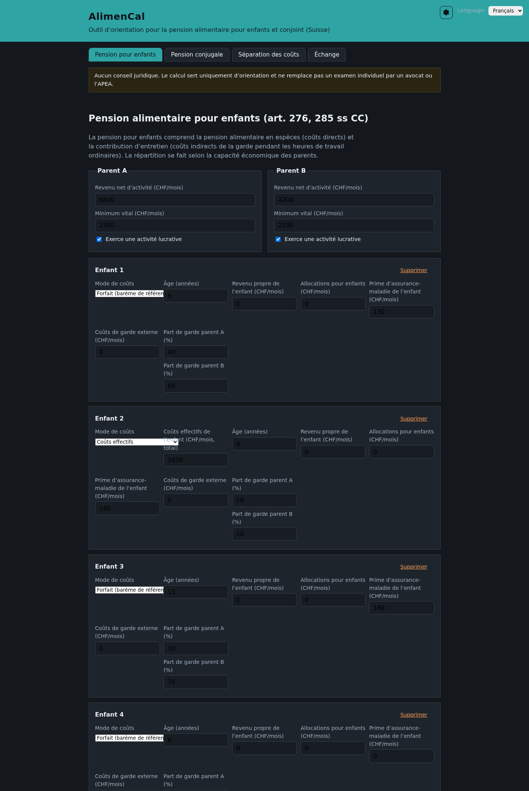
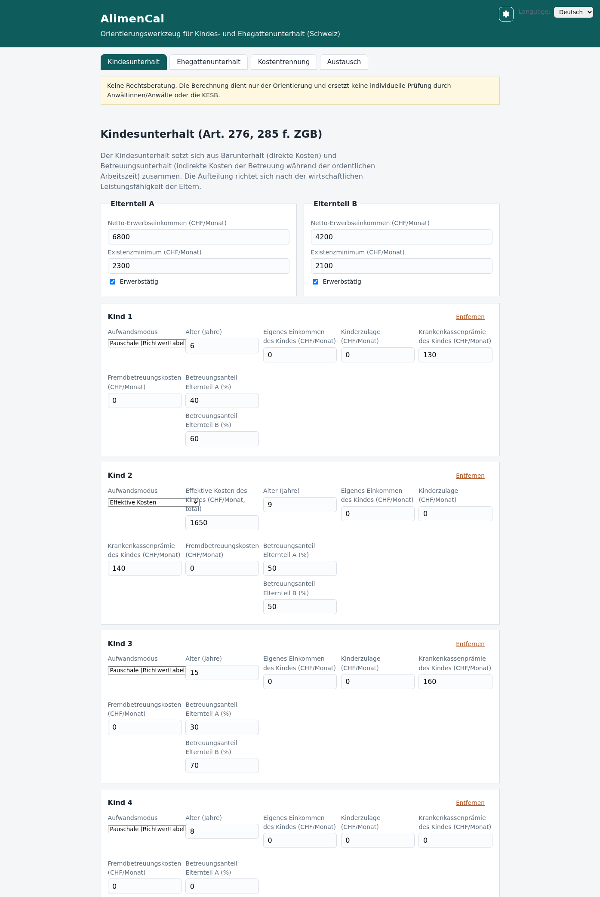
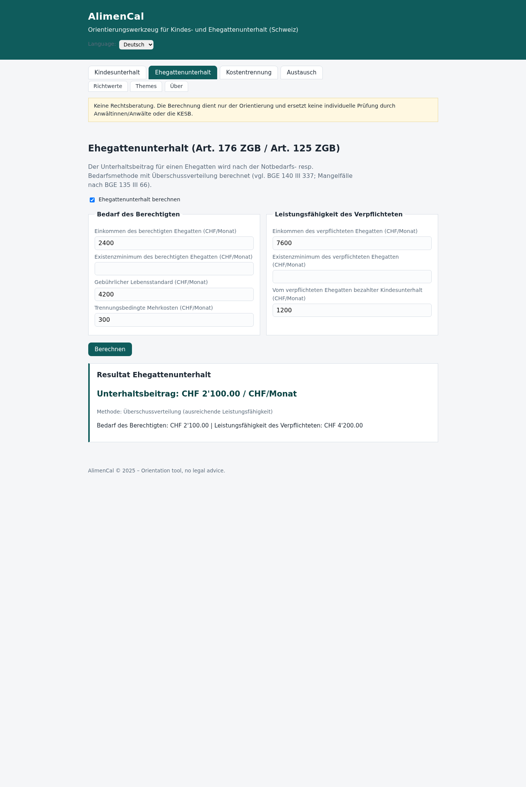
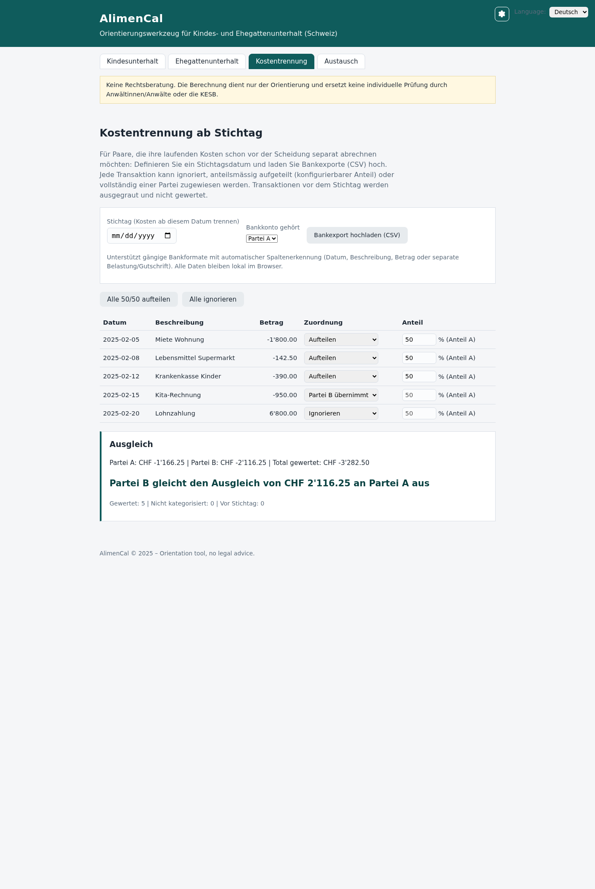
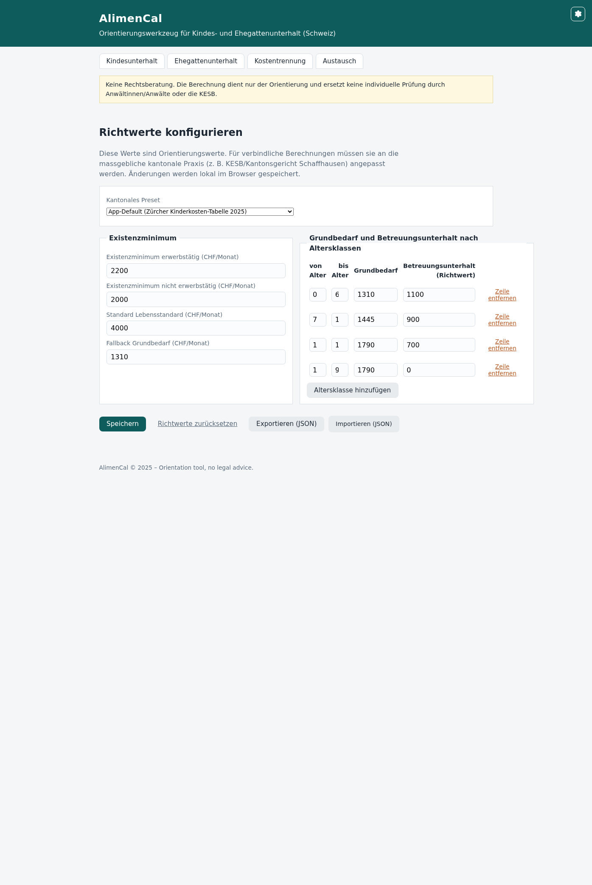
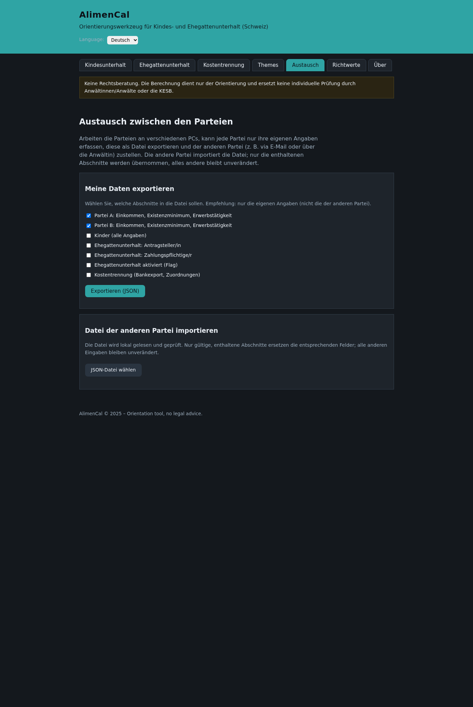
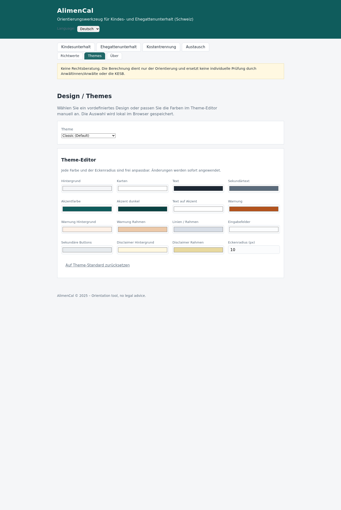
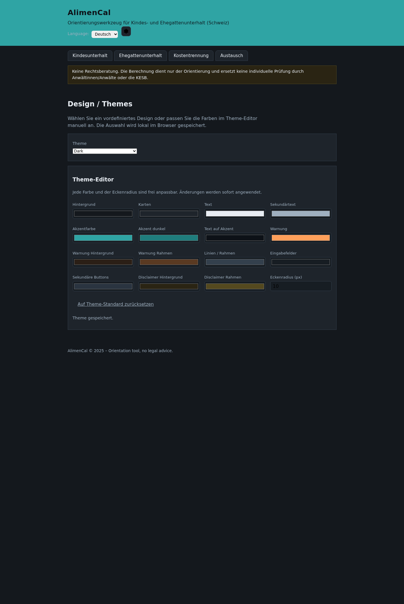

# AlimenCal – Benutzerhandbuch

AlimenCal ist ein mehrsprachiges Orientierungswerkzeug für Unterhaltsfragen bei
Trennung und Scheidung in der Schweiz. Die App läuft vollständig offline im
Browser; es werden keine Daten übertragen.

## Start

`index.html` im Browser öffnen – entweder direkt vom Dateisystem (`file://`)
oder von einem beliebigen statischen Webserver (z. B. GitHub Pages). Es gibt
keine Installation und keine Abhängigkeiten.

## Sprachen

Beispiel einer fremdsprachigen Ansicht (Français):

Oben rechts kann die Sprache gewählt werden: **Deutsch, Français, Italiano,
English**. Die Auswahl wird im Browser gespeichert (`localStorage`) und beim
nächsten Öffnen wiederhergestellt.

## Tabs im Überblick

| Tab | Zweck |
|---|---|
| Kindesunterhalt | Barunterhalt und Betreuungsunterhalt pro Kind berechnen |
| Ehegattenunterhalt | Bedarf/Leistungsfähigkeit und allfälliger Beitrag (Art. 176 / Art. 125 ZGB) |
| Kostentrennung | Laufende Kosten ab einem Stichtag separat abrechnen (Bankexport) |
| Themes | Vordefinierte Designs wählen, Farben im Theme-Editor anpassen |
| Austausch | Eigene Daten exportieren, Datei der anderen Partei importieren |
| Richtwerte | Richtwerte einsehen, anpassen, speichern, exportieren/importieren, kantionale Presets laden |

## Tab «Kindesunterhalt»

1. **Eltern**: Nettoeinkommen und allfälliges abweichendes Existenzminimum
   je Partei erfassen (Defaults: CHF 2200 erwerbstätig / CHF 2000 nicht
   erwerbstätig, betreibungsrechtliche Richtwerte als Orientierung).
2. **Kinder hinzufügen**: Alter (vollendete Altersjahre), allenfalls eigene
   Einkünfte und Kinderzulagen, effektive Krankenkassenprämie,
   Fremdbetreuungskosten sowie die Betreuungsanteile (z. B. 60/40).
3. **Aufwandsmodus**: Standardmässig wird der Grundbedarf pauschal aus der
   Richtwerttabelle ermittelt. Mit «Effektive Kosten» kann stattdessen der
   effektive Aufwand des Kindes (Total CHF/Monat) angegeben werden;
   Krankenkassenprämie und Fremdbetreuungskosten werden daraus abgezogen
   (separate Erfassung als direkte Kosten), um Doppelerfassungen zu vermeiden.
   Die Wahl gilt pro Kind und ist im Resultat ausgewiesen.
4. **Resultat**: Grundbedarf (altersgestaffelt oder effektive Kosten),
   Barunterhalt je Partei (aufgeteilt nach wirtschaftlicher
   Leistungsfähigkeit) und Betreuungsunterhalt (netto verrechnet zwischen
   den Parteien). Bei Unterdeckung wird eine Mangellage mit Mankobetrag
   ausgewiesen.

Hinweise:

- Bei 50/50-Betreuung ergibt der Betreuungsunterhalt netto keinen Saldo.
- Die Zürcher Tabellenwerte beinhalten eine pauschale Kinder-Krankenkassenprämie
  von CHF 130; diese ist im Default bereits abgezogen, damit die effektive
  Prämie nicht doppelt erfasst wird.

## Tab «Ehegattenunterhalt»

1. Checkbox aktivieren, falls ein Ehegattenunterhalt geprüft werden soll.
2. Angaben zum gebührenden Lebensstandard (Bedarf), allfällige Mehrkosten
   sowie Einkommen und Existenzminima beider Parteien erfassen.
3. **Resultat**: Bedarf, Leistungsfähigkeit und der allfällige Beitrag.
   Die App wendet die Überschussmethode (BGE 140 III 337) an; in Mangellagen
   wird der verfügbare Überschuss im Verhältnis der Existenzminima verteilt
   (Mankomethode, BGE 135 III 66).

## Tab «Kostentrennung»

Für Paare, die ihre laufenden Kosten schon **vor** der Scheidung separat
abrechnen wollen – ausführlich beschrieben in
[docs/KOSTENTRENNUNG.md](KOSTENTRENNUNG.md).

Kurz:

1. **Stichtag** wählen – Transaktionen davor werden nicht gewertet.
2. **Bankexport (CSV)** hochladen – Trennzeichen, Datums- und Betragsformate
   werden automatisch erkannt.
3. **Kontoinhaber** angeben (Partei A oder B).
4. Je Transaktion entscheiden: **ignorieren**, **anteilsmässig aufteilen**
   (Anteil je Transaktion konfigurierbar) oder **voll von Partei A bzw. B
   übernehmen**. Sammelaktionen erleichtern die Erstzuordnung.
5. **Ausgleich**: Die App zeigt, welche Partei der anderen wie viel schuldet.

## Tab «Richtwerte»

- Alle Richtwerte (Existenzminima, Grundbedarfe, Betreuungsunterhalt) sind
  hier sichtbar und anpassbar – vgl. die Default-Quellen im README.
- **Speichern** legt die angepassten Werte im Browser ab; **Export/Import**
  (JSON) erlaubt den Transfer zwischen Geräten.
- **Kantonale Presets** (z. B. Zürich 2025) können mit einem Klick geladen
  werden. Für den Kanton Schaffhausen existiert keine publizierte Tabelle;
  das mitgelieferte Preset ist ein Platzhalter mit Verifikations-Checkliste
  und **muss** vor Verwendung mit den effektiven Ansätzen von KESB/Kantonsgericht
  Schaffhausen ausgefüllt werden.

## Tab «Austausch» (zwei Parteien, zwei PCs)

Arbeiten die Parteien **nicht am selben PC**, trägt jede Partei nur ihre
eigenen Angaben ein und stellt sie der anderen Partei als Datei zu (z. B. per
E-Mail oder über die Anwältin/den Anwalt):

1. **Eigene Daten erfassen** – z. B. Partei A ihre Einkommenskarte im Tab
   «Kindesunterhalt», die andere Partei analog die ihre.
2. **Exportieren**: Im Tab «Austausch» die gewünschten Abschnitte anwählen
   (Empfehlung: nur die eigenen – nicht die der anderen Partei) und
   «Exportieren (JSON)» klicken. Es entsteht eine Datei `alimencal-case.json`.
3. **Datei übermitteln** – über einen vertraulichen Kanal. Die Datei enthält
   die Daten im Klartext (keine Verschlüsselung!).
4. **Importieren**: Die andere Partei wählt die erhaltene Datei im Tab
   «Austausch». Nur die in der Datei enthaltenen, gültigen Abschnitte
   ersetzen die entsprechenden Felder – **alle eigenen Eingaben bleiben
   unverändert**.

Exportierbare Abschnitte:

- Partei A / Partei B: Einkommen, Existenzminimum, Erwerbstätigkeit
- Kinder (alle Angaben)
- Ehegattenunterhalt: Antragsteller/in bzw. zahlungspflichtige Person
- Ehegattenunterhalt aktiviert (Kennzeichen)
- Kostentrennung (Bankexport inkl. Zuordnungen)

**Grenzen:** Die Datei ist nicht verschlüsselt und nicht signiert – die
Parteien müssen sich auf den Kanal einigen. Ein gemeinsames, gleichzeitiges
Bearbeiten gibt es nicht; der Austausch ist sequenziell (A exportiert,
B importiert, rechnet).

## Tab «Themes»

- **Vordefinierte Themes**: Classic (Default), Dark, High Contrast (barrierefrei,
  für Sehbehinderte geeignet), Warm und Blue – Auswahl wirkt sofort.
- **Theme-Editor**: Alle 15 Design-Farben und der Eckenradius sind manuell
  frei anpassbar. Änderungen werden sofort angewendet; die Auswahl springt auf
  «Benutzerdefiniert».
- **Zurücksetzen** stellt das Classic-Theme wieder her.
- Theme-Auswahl und angepasste Werte werden im Browser gespeichert und nach
einem Neustart wiederhergestellt.

## Persistenz (kein Datenverlust)

Alle Eingaben werden automatisch gespeichert und nach einem Browser-Neustart
wiederhergestellt:

- Formularfelder (Einkommen, Existenzminima, Ehegattenunterhalt, Stichtag,
  Kontoinhaber)
- Kinderliste mit allen Angaben
- Kostentrennung: Transaktionen aus dem Bankexport inklusive aller Zuordnungen
  und Anteile
- Sprache, Richtwerte und gewähltes Theme

Gespeichert wird bei jeder Eingabe sowie beim Verlassen/Neuladen der Seite
(`beforeunload`, `pagehide`, `visibilitychange`).

## Datenschutz

Alle Eingaben bleiben lokal im Browser (`localStorage`). Bankexporte werden
ausschliesslich im Browser geparsed – es findet kein Upload auf einen Server
statt. Die App funktioniert deshalb auch vollständig offline.

## Rechtlicher Hinweis

AlimenCal ist **keine Rechtsberatung** und ersetzt keine anwaltliche oder
behördliche Beurteilung. Die Resultate sind erste Orientierungswerte; massgebend
sind die Umstände des Einzelfalls und die Praxis der zuständigen Gerichte bzw.
der KESB. Siehe [docs/RECHTLICHE-GRUNDLAGEN.md](RECHTLICHE-GRUNDLAGEN.md).
