# AlimenCal – Benutzerhandbuch

AlimenCal ist ein mehrsprachiges Orientierungswerkzeug für Unterhaltsfragen bei
Trennung und Scheidung in der Schweiz. Die App läuft vollständig offline im
Browser; es werden keine Daten übertragen.

## Start

`index.html` im Browser öffnen – entweder direkt vom Dateisystem (`file://`)
oder von einem beliebigen statischen Webserver (z. B. GitHub Pages). Es gibt
keine Installation und keine Abhängigkeiten.

## Mobile Nutzung (Smartphone / Tablet)

Die App ist responsiv gestaltet und auf Smartphone, Tablet und Desktop nutzbar:

- Karten und Formular-Grids brechen auf schmalen Displays auf eine Spalte um.
- Auf Smartphones sind Titelzeile (H1) und Untertitel ausgeblendet (die
  Marke steht in der Topbar); der Hinweis «Keine Rechtsberatung» ist
  standardmässig eingeklappt (eine schlanke Zeile, per Tipp aufklappbar),
  und Tab-Überschriften/Intros sind verdichtet, damit Eingaben sofort
  sichtbar sind. Wer den Disclaimer einmal auf- oder zuklappt, dessen
  Wahl bleibt gespeichert.
- Die Mobile-Tab-Leiste (3 Hauptfunktionen + «Einstellungen») nutzt
  sprachspezifische Kurzlabels («Kind», «Ehegatte», «Kosten»), damit die
  Buttons auch auf schmalen Displays (ab 320px) sauber getrennt bleiben;
  überlange Labels werden mit Auslassungspunkten gekürzt.
- Resultat-, Kostentrennungs- und Richtwert-Tabellen sind auf schmalen
  Displays horizontal scrollbar (Wischen), damit alle Spalten lesbar bleiben.
- Auf Touch-Geräten sind Schaltflächen, Auswahlmenüs und Checkboxen
  vergrössert, um eine zuverlässige Bedienung zu ermöglichen.
- Auf Smartphones empfiehlt sich die Bereitstellung über einen Webserver
  (z. B. GitHub Pages), da das direkte Öffnen über `file://` dort nicht
  üblich ist. Gespeicherte Daten bleiben lokal im Browser des jeweiligen
  Geräts; ein Gerätewechsel erfolgt über den JSON-Export/Import im
  Austausch-Tab.

### Installation als App (PWA)

Bei Bereitstellung über HTTPS (z. B. GitHub Pages) kann AlimenCal als
Progressive Web App installiert und anschliessend offline genutzt werden:

1. Die App-URL in **Safari** öffnen (iOS/iPadOS) bzw. in Chrome (Android).
2. **Teilen-Taste** → **«Zum Home-Bildschirm hinzufügen»** (iOS) bzw.
   Menü → **«App installieren»** (Android).
3. Die App öffnet sich daraufhin im Vollbildmodus ohne Browserleiste; das
   Icon liegt auf dem Home-Bildschirm.

**Backup für Neuinstallation:** Da iOS beim Löschen einer Home-Screen-App
auch deren lokale Daten entfernt, bietet der Austausch-Tab eine
Backup-Funktion: «Backup erstellen (JSON)» exportiert **alle** Daten –
sämtliche Falldaten (beide Parteien, Kinder, Ehegattenunterhalt,
Kostentrennung) sowie Sprache, Design-Stil/Theme und die Richtwerte –
als eine Datei; auf iPhone/iPad kann sie im Share-Dialog direkt in die
Files-App oder iCloud Drive («In Dateien sichern») gespeichert werden.
Die Datei übersteht das Löschen der App. Empfehlung: nach jeder
wesentlichen Änderung ein neues Backup erstellen.

**Tägliche Backup-Erinnerung:** iOS erlaubt einer PWA keine
Hintergrund-Exporte; die App erinnert daher selbst daran: Sobald das
letzte Backup länger als 24 Stunden zurückliegt oder seitdem viele
Änderungen (≥ 25) vorgenommen wurden, erscheint beim Öffnen der App ein
Hinweisbanner mit «Backup jetzt erstellen» (Ein-Tipp-Export, danach
verschwindet das Banner wieder). «Später erinnern» blendet das Banner
für die aktuelle Sitzung aus. Der Zähler wird bei jedem erstellten
Backup zurückgesetzt.

**Erste Erinnerung (noch kein Backup):** Wer noch nie ein Backup
erstellt, aber bereits Daten erfasst hat (ab 5 Änderungen), erhält
dieselbe Erinnerung mit dem Hinweis, dass die Daten ohne Backup eine
De-/Neuinstallation nicht überstehen.

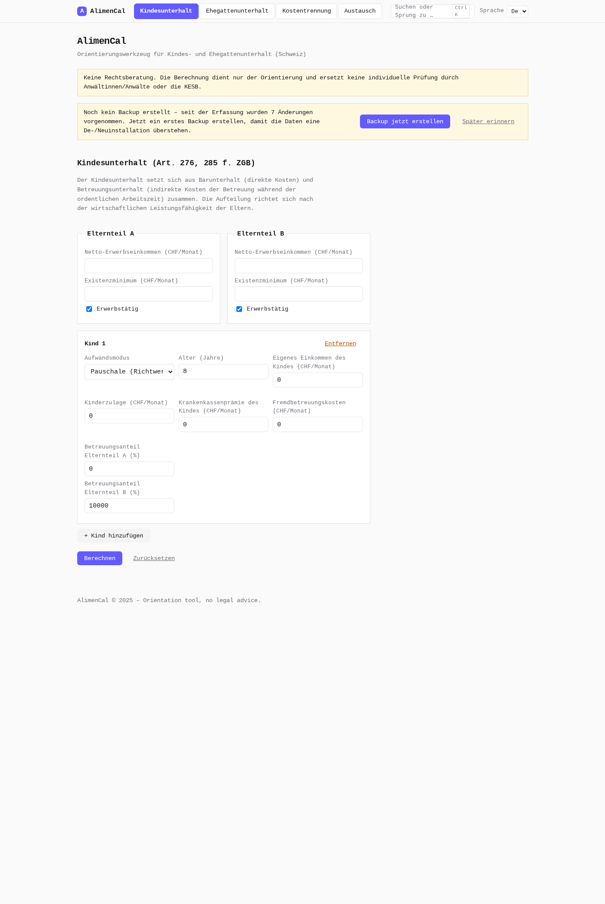

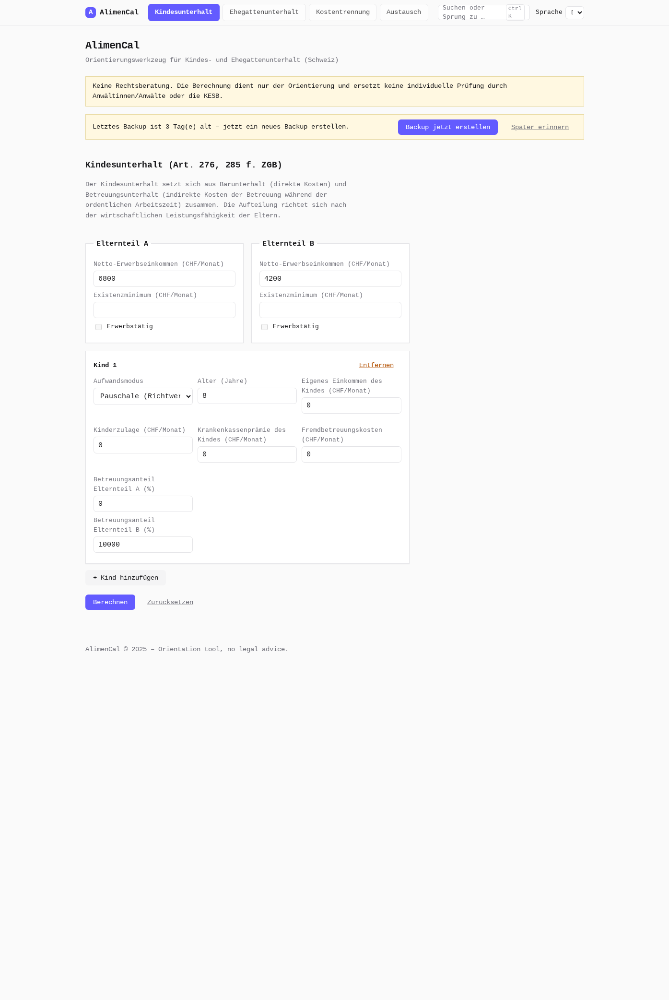

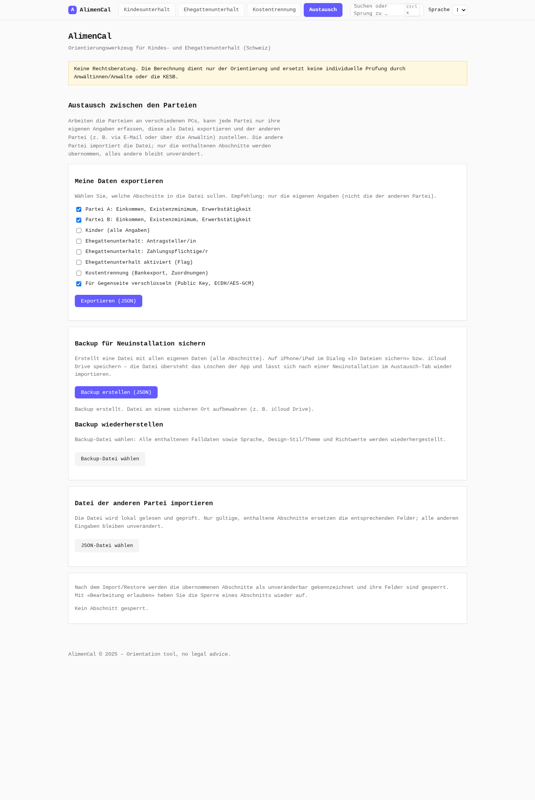

**Restore («Backup wiederherstellen»):** Die Backup-Datei direkt unter
der Backup-Funktion im Austausch-Tab auswählen («Backup-Datei wählen»).
Es werden alle enthaltenen Falldaten, Sprache, Design-Stil/Theme,
Richtwerte sowie die verbindlichen Einstellungen inklusive Lock-Zustand
(Two-Party-Lock) und die Schlüssel für signierte Lock-Dateien in einem
Schritt wiederhergestellt.

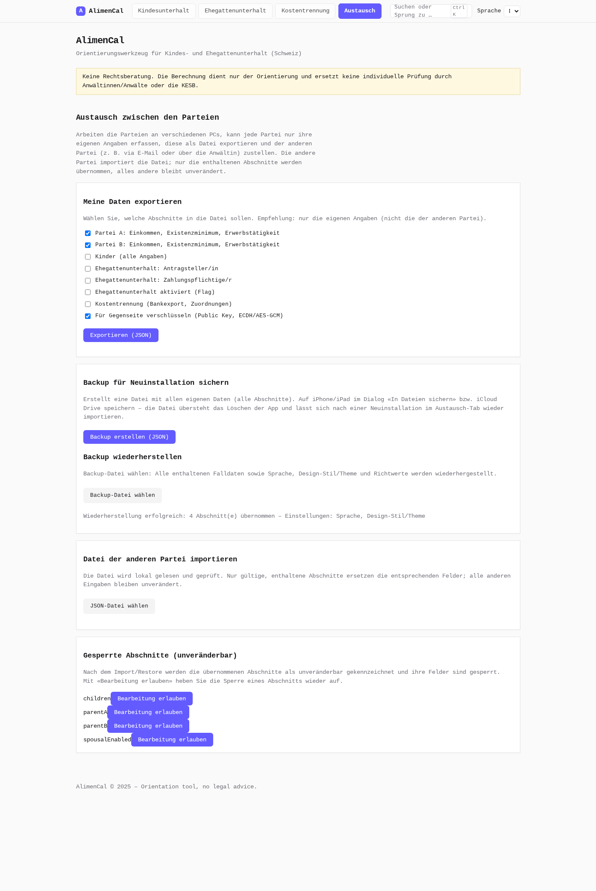

**Speicherort merken (Desktop-Browser):** Unterstützt der Browser die
File System Access API (Chrome/Edge am Desktop), merkt sich AlimenCal
den beim Backup gewählten Ordner (Knopf «Speicherort wählen …» beim
Backup). Jedes weitere Backup wird **automatisch in denselben Ordner**
geschrieben – ohne erneuten Dialog; der aktuelle Ordner wird unter dem
Knopf angezeigt. Nach einem Browser-Neustart fragt der Browser einmalig
die Berechtigung erneut ab (Klick auf «Backup erstellen» genügt).
Beim Restore/Import zeigt die App die **zuletzt verwendete Datei** an
und bietet sie per Knopf direkt zum Öffnen an – der Dateidialog entfällt.
Die Handles werden lokal in IndexedDB gespeichert und niemals übertragen.
Auf Browsern ohne diese API (z. B. Safari/iOS) gilt das bisherige
Verhalten: Download- bzw. Web-Share-Dialog und freie Dateiauswahl.

**Gesperrte Abschnitte (unveränderbar):** Nach dem Import einer
Parteien-Datei oder dem Restore werden die übernommenen Abschnitte als
unveränderbar gekennzeichnet – ihre Felder sind gesperrt und mit einem
Hinweis versehen. Die Sperre gilt pro Abschnitt und wird im localStorage
persistiert (FORM_VERSION 5); sie übersteht also einen Browser-Neustart.
Im Austausch-Tab listet die Karte «Gesperrte Abschnitte (unveränderbar)»
alle gesperrten Abschnitte; mit «Bearbeitung erlauben» wird die Sperre
eines Abschnitts aufgehoben (bewusstes Freigeben, danach normal
editierbar). Vom Two-Party-Lock (verbindliche Einstellungen) gesperrte
Richtwert-Felder bleiben davon unberührt und haben Vorrang. Das Format ist getrennt
vom Parteien-Austausch (`alimencal-backup` statt `alimencal`) und wird
eigens validiert; der Parteien-Import bleibt unverändert. Die
Wiederherstellung überschreibt die aktuellen Werte mit denjenigen aus
der Datei – also nur mit einem Backup des gewünschten Stands durchführen.

Technische Grundlage sind `manifest.json` und der Service Worker `sw.js`
im Repository-Root, der alle App-Dateien für die Offline-Nutzung cacht
(network-first: Aktualisierungen greifen nach einem Reload; der Cache
dient als Offline-Fallback).
Die Service-Worker-Registrierung erfolgt automatisch, wenn die App über
HTTPS aufgerufen wird (nicht bei `file://`). Gespeicherte Daten bleiben
auch in der installierten App lokal im Browser-Speicher des jeweiligen
Geräts.

Die Screenshots in diesem Handbuch zeigen die PC-Ansicht (1395×2084).
Die gleichen Ansichten im iPhone- (390×844) und iPad-Viewport (820×1180)
liegen unter `screenshots/iphone/` bzw. `screenshots/ipad/` im Repository.

Beispiel Kindesunterhalt im iPhone-Viewport – Grids brechen auf eine
Spalte um, die Tab-Navigation bleibt scrollbar:

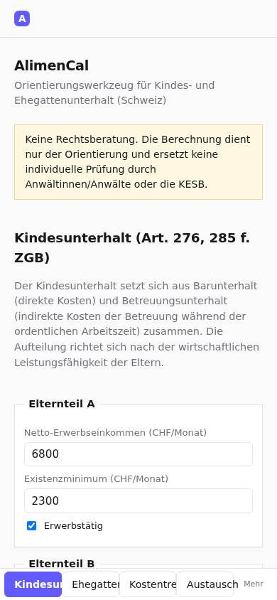

Beispiel Kostentrennung im iPhone-Viewport – die Transaktionstabelle
ist horizontal scrollbar:

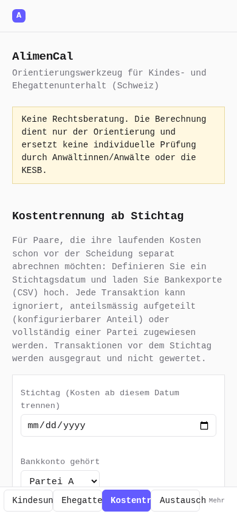

## Sprachen

Jede Ansicht existiert in allen vier Sprachen; Beispiel Kindesunterhalt
auf Französisch:

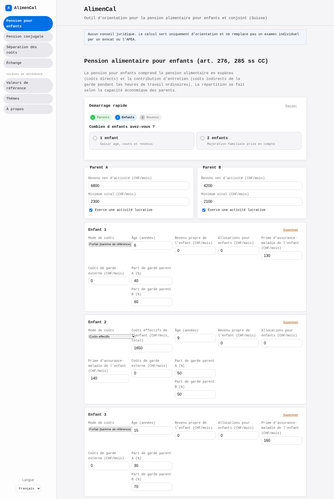

Die Sprache wird in der Topbar (Desktop) gewählt: **Deutsch, Français,
Italiano, English**; auf dem Smartphone liegt die Sprachwahl in den
Einstellungen. Die Auswahl wird im Browser gespeichert (`localStorage`)
und beim nächsten Öffnen wiederhergestellt.

## Tabs im Überblick

Die Hauptfunktionen sind auf dem Desktop dauerhaft in der schmalen Kopfzeile
(Topbar) sichtbar: Kindesunterhalt, Ehegattenunterhalt, Kostentrennung und Vermögensausgleich.
Der Einstellungs- und Infobereich (Austausch, Backup, Richtwerte, Themes,
Über) ist über den deutlich beschrifteten Knopf «Einstellungen und
Informationen» (Zahnrad-Symbol) neben der Befehlspalette erreichbar; die
Befehlspalette (Ctrl+K) bleibt als Tastatur-Kürzel erhalten. Auf dem
Smartphone liegt eine task-orientierte Tab-Leiste mit den vier
Hauptfunktionen und «Einstellungen» am unteren Rand.

**Funktionen (Hauptnavigation):**

| Tab | Zweck |
|---|---|
| Kindesunterhalt | Barunterhalt und Betreuungsunterhalt pro Kind berechnen |
| Ehegattenunterhalt | Bedarf/Leistungsfähigkeit und allfälliger Beitrag (Art. 176 / Art. 125 ZGB) |
| Kostentrennung | Laufende Kosten ab einem Stichtag separat abrechnen (Bankexport) |
| Vermögensausgleich | Vermögenswerte beider Parteien zum Stichtag erfassen und hälftig ausgleichen (vereinfacht, ohne Güterrecht) |

**Einstellungen & Info (über den Knopf «Einstellungen und Informationen» bzw. Ctrl+K):**

| Eintrag | Zweck |
|---|---|
| Austausch | Eigene Daten exportieren, Datei der anderen Partei importieren |
| Backup | Backup erstellen und wiederherstellen (im Austausch-Tab integriert) |
| Richtwerte | Richtwerte einsehen, anpassen, speichern, exportieren/importieren, kantionale Presets laden |
| Themes | Design-Stil wählen, Farben im Theme-Editor anpassen |
| Personen & Sicherheit | Namen der Parteien, Rollenwahl, verbindliche Einstellungen, Schlüssel und Lock-Datei |
| Über | Informationen zur App, Rechtsgrundlagen und Disclaimer |

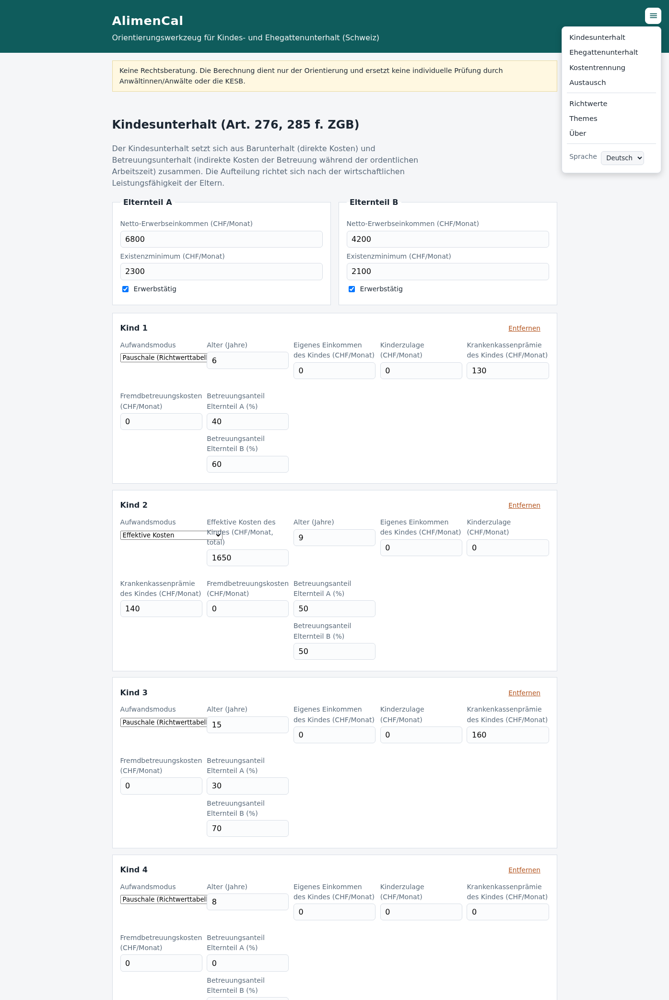

## Tab «Kindesunterhalt»

1. **Eltern**: Nettoeinkommen und allfälliges abweichendes Existenzminimum
   je Partei erfassen (Defaults: CHF 2200 erwerbstätig / CHF 2000 nicht
   erwerbstätig, betreibungsrechtliche Richtwerte als Orientierung).
2. **Kinder hinzufügen**: Alter (vollendete Altersjahre), allenfalls eigene
   Einkünfte und Kinderzulagen, effektive Krankenkassenprämie,
   Fremdbetreuungskosten sowie die Betreuungsanteile (z. B. 60/40). Die
   beiden Anteile ergänzen sich automatisch auf insgesamt 100 %: Wird ein
   Wert geändert, passt sich das Gegenfeld sofort an.
3. **Aufwandsmodus**: Standardmässig wird der Grundbedarf pauschal aus der
   Richtwerttabelle ermittelt. Mit «Effektive Kosten» kann stattdessen der
   effektive Aufwand des Kindes (Total CHF/Monat) angegeben werden;
   Krankenkassenprämie und Fremdbetreuungskosten werden daraus abgezogen
   (separate Erfassung als direkte Kosten), um Doppelerfassungen zu vermeiden.
   Die Wahl gilt pro Kind und ist im Resultat ausgewiesen.
4. **Resultat**: Pro Kind eine kompakte Aufschlüsselung mit Grundbedarf
   (altersgestaffelt oder effektive Kosten), Barunterhalt je Partei
   (aufgeteilt nach wirtschaftlicher Leistungsfähigkeit) und
   Betreuungsunterhalt (netto verrechnet zwischen den Parteien); je
   Kind sind die Totals je Partei ausgewiesen. Bei Unterdeckung wird
   eine Mangellage mit Mankobetrag ausgewiesen.

Hinweise:

- Bei 50/50-Betreuung ergibt der Betreuungsunterhalt netto keinen Saldo.
- Die Zürcher Tabellenwerte beinhalten eine pauschale Kinder-Krankenkassenprämie
  von CHF 130; diese ist im Default bereits abgezogen, damit die effektive
  Prämie nicht doppelt erfasst wird.

## Tab «Ehegattenunterhalt»

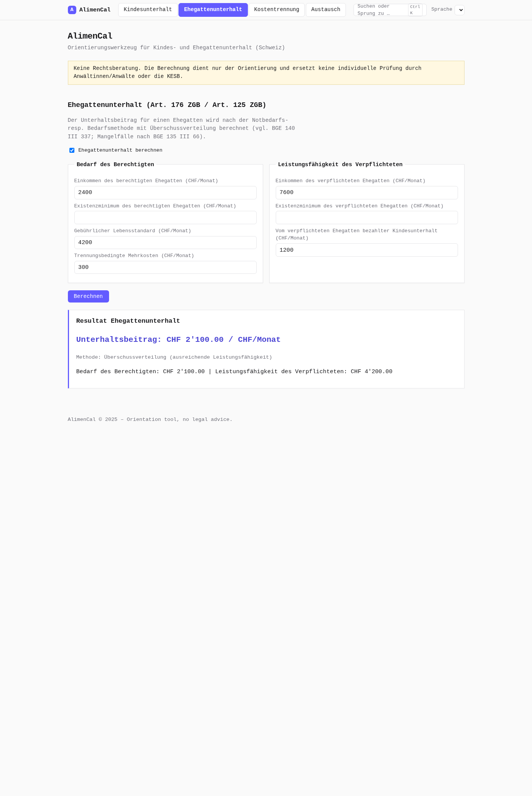

1. Checkbox aktivieren, falls ein Ehegattenunterhalt geprüft werden soll.
2. Angaben zum gebührenden Lebensstandard (Bedarf), allfällige Mehrkosten
   sowie Einkommen und Existenzminima beider Parteien erfassen.
3. **Resultat**: Bedarf, Leistungsfähigkeit und der allfällige Beitrag.
   Die App wendet die Überschussmethode (BGE 140 III 337) an; in Mangellagen
   wird der verfügbare Überschuss im Verhältnis der Existenzminima verteilt
   (Mankomethode, BGE 135 III 66).

## Tab «Kostentrennung»

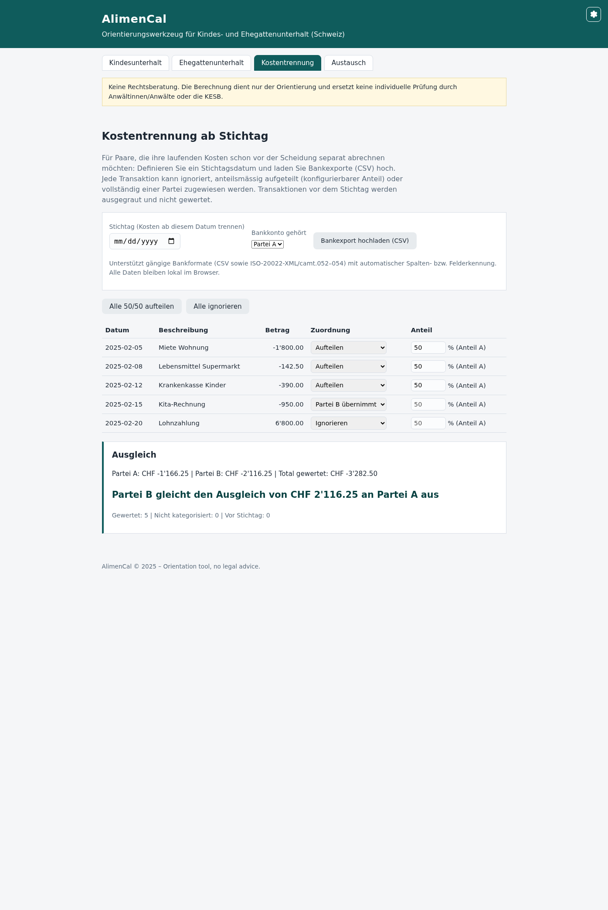

Für Paare, die ihre laufenden Kosten schon **vor** der Scheidung separat
abrechnen wollen – ausführlich beschrieben in
[docs/KOSTENTRENNUNG.md](KOSTENTRENNUNG.md).

Kurz:

1. **Stichtag** wählen – Transaktionen davor werden nicht gewertet.
2. **Bankexport** hochladen – CSV (Trennzeichen, Datums- und Betragsformate
   werden automatisch erkannt) oder ISO-20022-XML (camt.052/053/054); das
   Format wird automatisch erkannt.
3. **Kontoinhaber** angeben (Partei A oder B; werden im Tab «Personen & Sicherheit»
   Partei-Namen erfasst, erscheinen diese stattdessen).
4. Je Transaktion entscheiden: **ignorieren**, **anteilsmässig aufteilen**
   (Anteil je Transaktion konfigurierbar) oder **voll von Partei A bzw. B
   übernehmen**. Sammelaktionen erleichtern die Erstzuordnung.
5. **Ausgleich**: Die App zeigt, welche Partei der anderen einen Ausgleichsbetrag bezahlt.

## Tab «Vermögensausgleich»

Vermögenswerte (Konten, Anlagen, ETF, Bargeld, Immobilien, Vorsorge,
Schulden) beider Parteien als **Saldo zu einem Stichtag** erfassen und
einfach ausgleichen – ausführlich beschrieben in
[VERMOEGENSAUSGLEICH.md](VERMOEGENSAUSGLEICH.md).

Kurz:

1. **Stichtag** wählen; per Knopf «Tag vor Kostentrennung übernehmen»
   vom Stichtag der Kostentrennung ableitbar.
2. **Vermögenswerte hinzufügen**: Bezeichnung, Kategorie, Partei
   (A, B oder gemeinsam mit Anteil; sind Partei-Namen erfasst,
   erscheinen diese statt Partei A/B), Saldo per Stichtag. Schulden als
   negative Werte erfassen.
3. **Ausgleich**: Die App zeigt Nettovermögen je Partei, Total,
   hälftigen Soll und wer wie viel ausgleicht.

Hinweis: Der Modus ist bewusst einfach (hälftige Teilung des
Nettovermögens, ohne Eigengut-Prüfung und ohne Herleitung der
Errungenschaften) und liefert einen Orientierungswert – kein
güterrechtliches Resultat. Details und Rechtshinweise:
[VERMOEGENSAUSGLEICH.md](VERMOEGENSAUSGLEICH.md).

## Tab «Richtwerte»

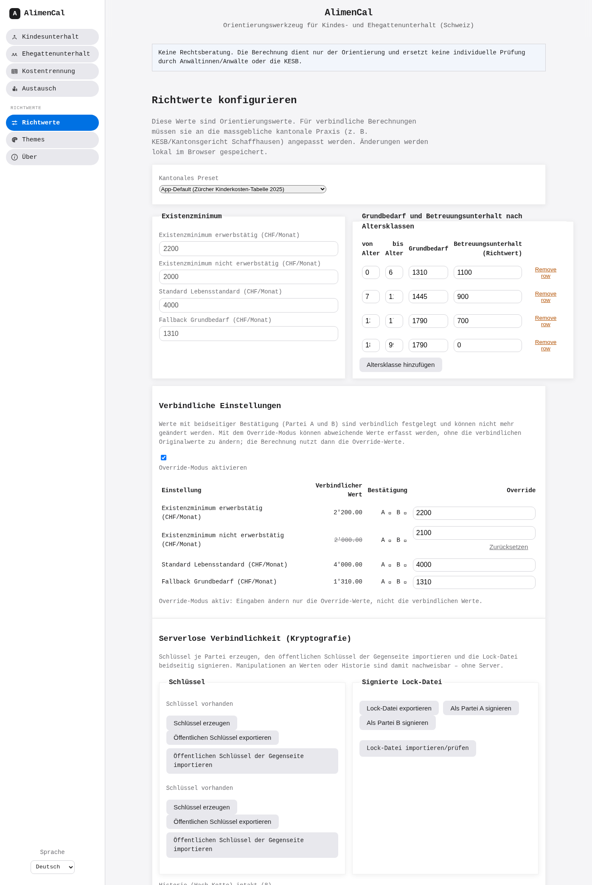

- Alle Richtwerte (Existenzminima, Grundbedarfe, Betreuungsunterhalt) sind
  hier sichtbar und anpassbar – vgl. die Default-Quellen im README.
- **Speichern** legt die angepassten Werte im Browser ab; **Export/Import**
  (JSON) erlaubt den Transfer zwischen Geräten.
- **Kantonale Presets** (z. B. Zürich 2025) können mit einem Klick geladen
  werden. Für den Kanton Schaffhausen existiert keine publizierte Tabelle;
  das mitgelieferte Preset ist ein Platzhalter mit Verifikations-Checkliste
  und **muss** vor Verwendung mit den effektiven Ansätzen von KESB/Kantonsgericht
  Schaffhausen ausgefüllt werden.
- **Rollenwahl («Meine Rolle»):** Im Bereich «Verbindliche Einstellungen»
  kann gewählt werden, als welche Partei diese App-Instanz betrieben wird
  («Ich bin {Partei A/B}») oder «Gemeinsam / keine Rolle» (Default,
  z. B. für Mediation oder gemeinsame Nutzung). Mit gewählter Rolle
  können nur die **eigenen** Bestätigungen gesetzt sowie die eigenen
  Schlüssel erzeugt/exportiert/importiert und die Lock-Datei nur für die
  eigene Partei signiert werden; für die Gegenpartei erscheint der
  Hinweis «Nur durch {Partei} möglich». Deren Bestätigung muss aus deren
  App-Instanz stammen (Fall- bzw. Lock-Datei-Import). Die Wahl wird lokal
  gespeichert und lässt sich jederzeit ändern.
- **Verbindliche Einstellungen (Two-Party-Lock):** Die vier Basiswerte
  (Existenzminima erwerbstätig/nichterwerbstätig, Standard Lebensstandard,
  Fallback Grundbedarf) können von beiden Parteien separat bestätigt werden
  (Buttons «Partei A» / «Partei B»). Erst nach **beidseitiger Bestätigung**
  sind sie verbindlich festgelegt und read-only; Änderungen sind dann nur
  noch über den Override-Modus oder einen bewussten Neustart des
  Bestätigungsprozesses möglich.
- **Override-Modus:** Mit der Checkbox «Override-Modus aktivieren» können
  abweichende Werte erfasst werden, **ohne die verbindlichen Originalwerte
  zu ändern**. Die Berechnungen (Kindes- und Ehegattenunterhalt) nutzen dann
  die Override-Werte; der verbindliche Wert bleibt in der Tabelle sichtbar
  (durchgestrichen) und wird nie verändert. Ein Klick auf «Zurücksetzen»
  entfernt den Override und stellt die Originalberechnung wieder her.
- **Serverlose Verbindlichkeit (Kryptografie):** Im selben Tab lassen sich
  pro Partei Schlüssel erzeugen (bleiben lokal im Browser), öffentliche
  Schlüssel gegenseitig importieren und die Lock-Datei von beiden Parteien
  signieren. Der Import einer Lock-Datei prüft Werte-Hash, beide Signaturen
  und Abweichungen von den eigenen Werten – Manipulationen sind damit
  nachweisbar. Die Historie aller Aktionen ist zusätzlich als Hash-Kette
  gesichert; ihr Status wird unter der Sektion angezeigt.
- Hinweis: Die Verbindlichkeit wirkt im rein lokalen Betrieb (ohne Server)
  pro Browser; die kryptografische Prüfung (Kette + Signaturen) macht
  Abweichungen nachweisbar. Eine erzwungene Schreibsperre auf gemeinsamer
  Ablage bleibt ohne Server ausgeschlossen (vgl.
  docs/settings-binding-override.md).

## Tab «Personen & Sicherheit»

Hier sind alle personen- und sicherheitsbezogenen Funktionen gebündelt
(Namen der Parteien, Rollenwahl, verbindliche Einstellungen, Kryptografie).
Diese Karten waren früher im Tab «Richtwerte» zu finden.

- **Namen der Parteien:** Zwei Namensfelder; die Namen ersetzen «Partei A / B»
  in der gesamten App (Bestätigungs-Buttons, Schlüssel-Status, Kostentrennung,
  Export/Import).
- **Verbindliche Einstellungen (Two-Party-Lock):** Rollenwahl
  «Meine Rolle» und beidseitige Bestätigung der Basiswerte (Details siehe
  Abschnitt «Verbindliche Einstellungen» unten).
- **Serverlose Verbindlichkeit (Kryptografie):** Schlüssel je Partei erzeugen,
  öffentliche Schlüssel austauschen, Lock-Datei beidseitig signieren und
  importieren/prüfen.

### Willkommens-Assistent (Erststart)

Beim allerersten Start öffnet sich ein Assistent in vier Schritten:

1. **Namen:** Namen der Parteien A und B (optional).
2. **Rolle:** Als welche Partei diese App-Instanz betrieben wird
   («Ich bin {Partei A/B}» oder «Gemeinsam / keine Rolle»).
3. **Schlüssel:** ECDSA-Schlüssel für die eigene (oder bei gemeinsamer
   Nutzung beider) Partei erzeugen – nur nötig, wer Lock-Dateien signieren
   will.
4. **Export:** Öffentlichen Schlüssel als Datei exportieren und der
   Gegenseite zustellen.

Jeder Schritt ist überspringbar («Überspringen»); der Assistent lässt sich
später über die Befehlspalette (Ctrl+K, «Willkommens-Assistent öffnen»)
erneut starten. Bestandsnutzer mit vorhandenen Formulardaten sehen den
Assistenten nicht automatisch.

## Tab «Austausch» (zwei Parteien, zwei PCs)

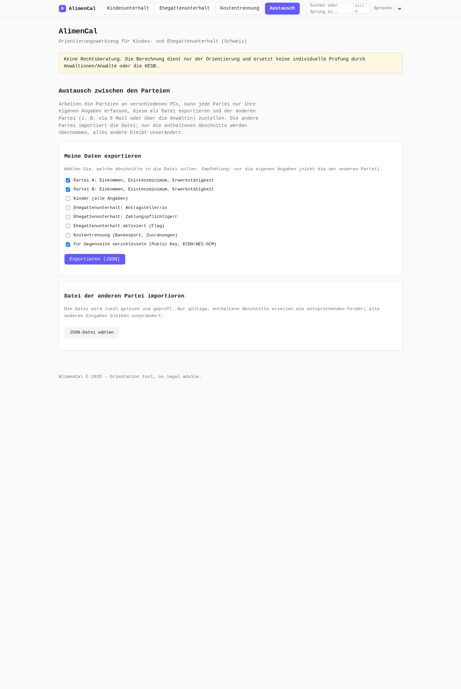

Arbeiten die Parteien **nicht am selben PC**, trägt jede Partei nur ihre
eigenen Angaben ein und stellt sie der anderen Partei als Datei zu (z. B. per
E-Mail oder über die Anwältin/den Anwalt):

1. **Eigene Daten erfassen** – z. B. Partei A ihre Einkommenskarte im Tab
   «Kindesunterhalt», die andere Partei analog die ihre.
2. **Exportieren**: Im Tab «Austausch» die gewünschten Abschnitte anwählen
   (Empfehlung: nur die eigenen – nicht die der anderen Partei) und
   «Exportieren (JSON)» klicken. Es entsteht eine Datei `alimencal-case.json`.

**Verschlüsselter Export (empfohlen):** Ist die Option «Für Gegenseite
verschlüsseln» aktiviert (Standard), wird die Datei mit dem öffentlichen
Schlüssel der Gegenseite verschlüsselt (ECDH P-256 + AES-GCM, Web Crypto):
`alimencal-case-encrypted.json`. Voraussetzung: Der Public Key der
Gegenseite wurde zuvor im Tab «Einstellungen» unter «Schlüssel» importiert
und man besitzt selbst ein Schlüsselpaar (Schlüssel generieren). Nur die
Gegenseite kann die Datei mit ihrem privaten Schlüssel entschlüsseln – der
Exporteur selbst kann die Datei nachträglich nicht mehr lesen. Die Datei
kann nun auch über weniger vertrauliche Kanäle (z. B. E-Mail über die
Anwältin/den Anwalt) übermittelt werden.

3. **Datei übermitteln** – verschlüsselt (empfohlen, s. o.) oder als
   unverschlüsseltes JSON über einen vertraulichen Kanal.
4. **Importieren**: Die andere Partei wählt die erhaltene Datei im Tab
   «Austausch». Verschlüsselte Dateien werden automatisch erkannt und mit
   dem eigenen privaten Schlüssel lokal entschlüsselt. Nur die in der Datei
   enthaltenen, gültigen Abschnitte
   ersetzen die entsprechenden Felder – **alle eigenen Eingaben bleiben
   unverändert**.

Exportierbare Abschnitte:

- Partei A / Partei B: Einkommen, Existenzminimum, Erwerbstätigkeit
- Kinder (alle Angaben)
- Ehegattenunterhalt: Antragsteller/in bzw. zahlungspflichtige Person
- Ehegattenunterhalt aktiviert (Kennzeichen)
- Kostentrennung (Bankexport inkl. Zuordnungen)

**Grenzen:** Ohne Verschlüsselungsoption ist die Datei unverschlüsselt und nicht
signiert – die Parteien müssen sich auf den Kanal einigen. Der
verschlüsselte Export schützt nur die Vertraulichkeit (nur die Gegenseite
kann lesen), aber keine Urheberschaft: Er ist keine Unterschrift; für
Verbindlichkeit siehe Tab «Einstellungen», signierte Lock-Dateien. Ein gemeinsames, gleichzeitiges
Bearbeiten gibt es nicht; der Austausch ist sequenziell (A exportiert,
B importiert, rechnet).

## Geräte-Sync (eigene Daten auf eigenen Geräten)

Der **Geräte-Sync** (Same-User) synchronisiert die eigenen Falldaten auf
mehreren eigenen Geräten (PC, Tablet, Smartphone) – ohne Server. Die App
schreibt dazu eine Datei `alimencal-sync.json` in einen vom Nutzer
gewählten Ordner, den ein Datei-Dienst der Wahl synchronisiert (iCloud
Drive, Dropbox, Syncthing auf eigenem NAS …). Der Anbieter sieht dabei nur
Chiffre: Die Sync-Datei ist **standardmässig passwortverschlüsselt**
(PBKDF2-HMAC-SHA256 mit ≥ 600 000 Iterationen + AES-GCM, Web Crypto).
Klartext ist nur ausdrücklich wählbar und mit klarer Warnung möglich.

Der Geräte-Sync ist klar vom **Austausch** (Two-Party) zu unterscheiden: Er
synchronisiert die eigenen Daten auf eigenen Geräten, nicht die Daten der
Gegenpartei. Der Sync-Abschnitt befindet sich im Austausch-Tab.

### Einrichtung (Desktop)

1. Sync-Ordner wählen («Sync-Ordner wählen …»). Der Ordner wird gemerkt
   (File System Access API, analog gemerkte Backup-Speicherorte).
2. Sync-Passwort setzen (mind. 4 Zeichen). Das Passwort wird lokal im
   Browser gespeichert; die Sync-Datei wird damit verschlüsselt.
3. «Geräte-Sync aktivieren» einschalten (Standard: aus).

Danach schreibt die App nach Änderungen debounced (ca. 5 s nach letzter
Eingabe) sowie beim Schliessen der Seite automatisch in die Sync-Datei.
Der Status zeigt die letzte Sync-Datei (Zeitpunkt + Änderungsstand).

### Merge beim App-Start

Ist die Sync-Datei neuer als der lokale Stand (`syncMeta.updatedAt` /
`changeCount`), erscheint vor der Übernahme ein Dialog mit Zusammenfassung
der betroffenen Abschnitte. Der Merge erfolgt abschnittsweise analog dem
Austausch-Import: eigene, nicht enthaltene Abschnitte bleiben
unverändert. Im Konflikt (lokal und Datei geändert) gewinnt abschnittsweise
der neuere Stand, mit klarem Hinweis – niemals werden Daten still
verworfen. Verbindliche Einstellungen (Two-Party-Lock) werden nicht
umgangen; gesperrte (Read-Only-)Abschnitte werden nicht überschrieben.

### Berechtigungsverlust

Nach einem Browser-Neustart verlangt der gemerkte Ordner erneut eine
Freigabe; die App bietet die erneute Ordnerfreigabe an. Schreibfehler
werden still tolerieren und beim erstmaligen Scheitern kurz informiert.

### iOS/Mobile

Ohne File System Access API (iPhone/iPad) bleibt der bestehende manuelle
Backup-/Restore-Flow: Sync-Datei in die Dateien-App/iCloud Drive legen und
per Restore importieren. Ein Hintergrund-Sync ist auf iOS als PWA nicht
möglich (Browser-Limitierung); der Sync-Abschnitt zeigt eine kurze
Anleitung.

## Tab «Themes»

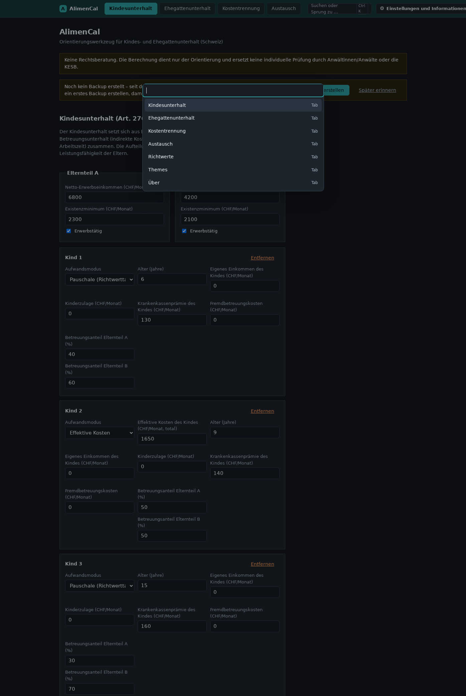

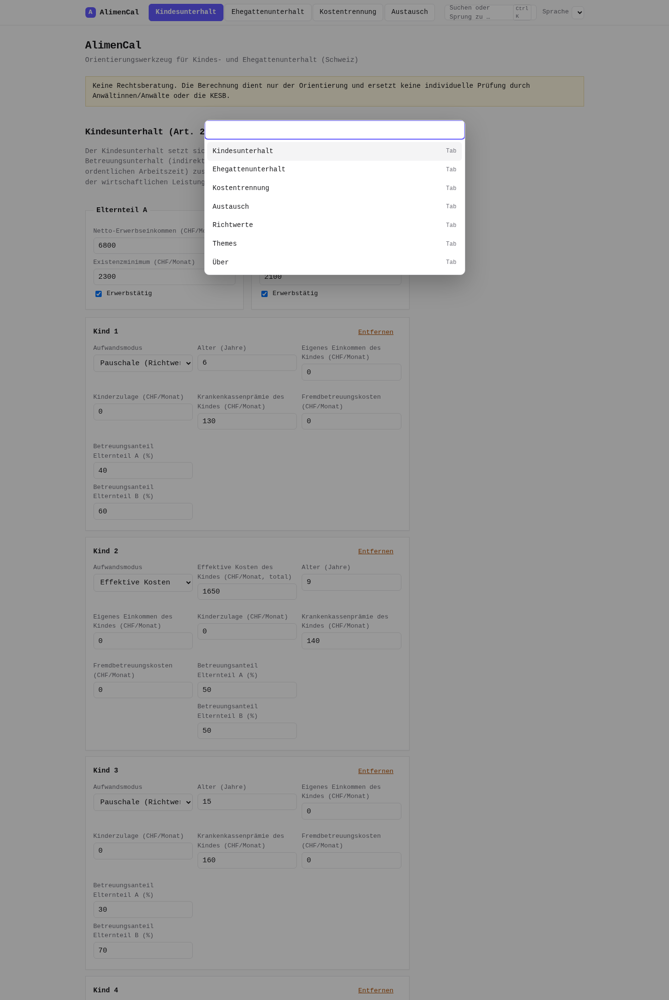

- **Design-Stil**: Im Themes-Tab wird das Erscheinungsbild über die
  Design-Stil-Auswahl mit anklickbaren Karten gewählt. Jeder Stil passt das
  komplette Erscheinungsbild an (Typografie, Karten, Rahmen, Schatten und
  Farben): **Calm** (Standard, helles Werkzeug-Design), **Klassisch** (ursprüngliches Aussehen), **Calm Dark**, **Editorial/Legal** und **Neo-Brutalismus**. Die Auswahl wirkt sofort.
- **Theme-Editor**: Alle 17 Design-Farben und der Eckenradius sind manuell
  frei anpassbar; inklusive Hintergrund und Textfarbe des oberen Banners,
  das auch mit dem gewählten Design-Stil wechselt. Änderungen werden sofort
  angewendet; der Design-Stil bleibt dabei erhalten.
- **Zurücksetzen** stellt den Design-Stil Calm wieder her.
- Design-Stil und angepasste Werte werden im Browser gespeichert und nach
  einem Neustart wiederhergestellt.
- Alle Design-Stile sind responsiv und funktionieren auf Smartphones,
  Tablets und Desktop; die Design-Karten ordnen sich auf kleinen
  Bildschirmen zweispaltig an.

Die Design-Stile im Überblick (Kindesunterhalt-Ansicht, Deutsch):

| Design-Stil | Vorschau |
|---|---|
| Calm (Standard) | 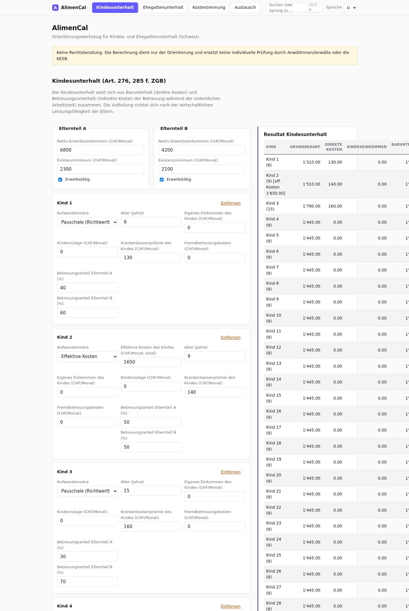 |
| Klassisch | 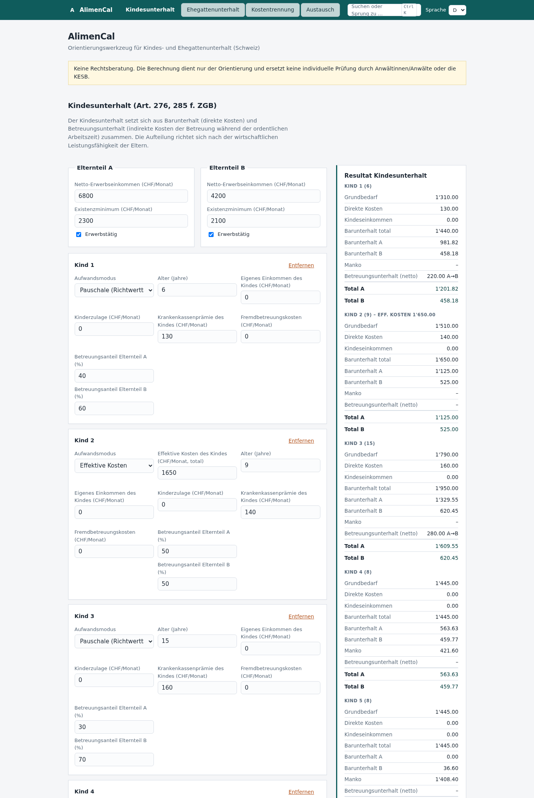 |
| Calm Dark | 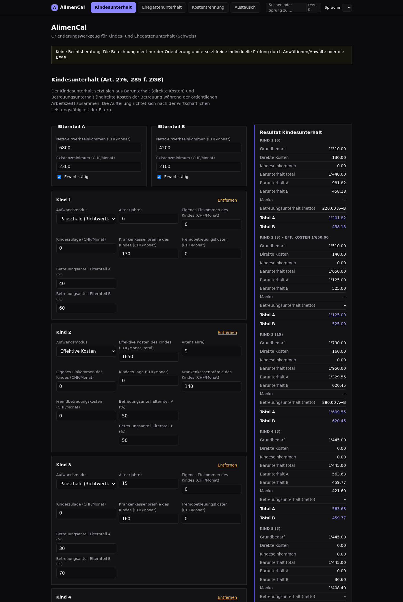 |
| Editorial / Legal | 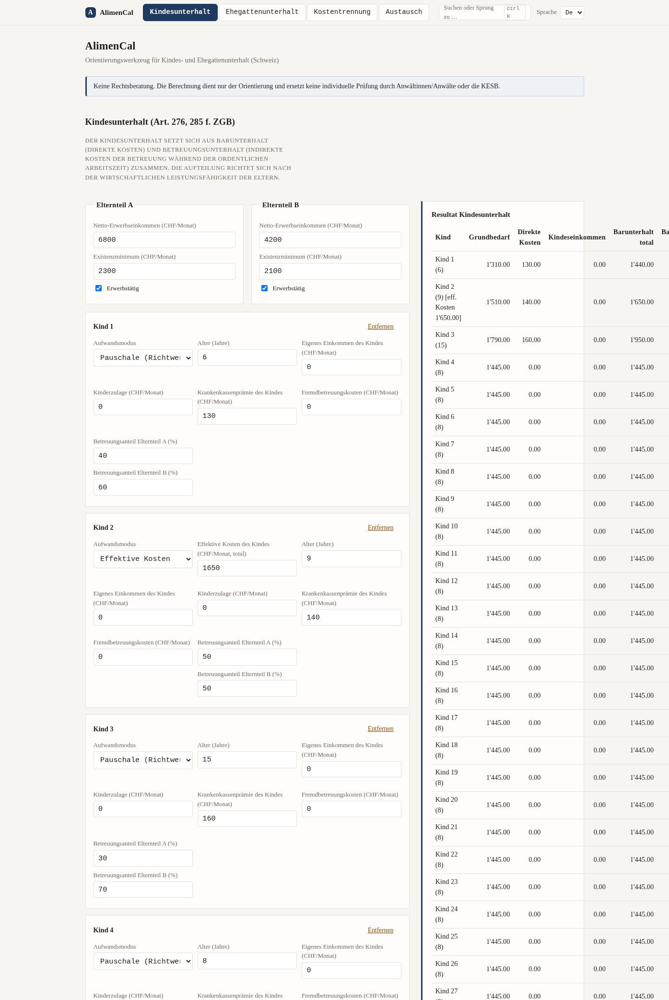 |
| Neo-Brutalismus | 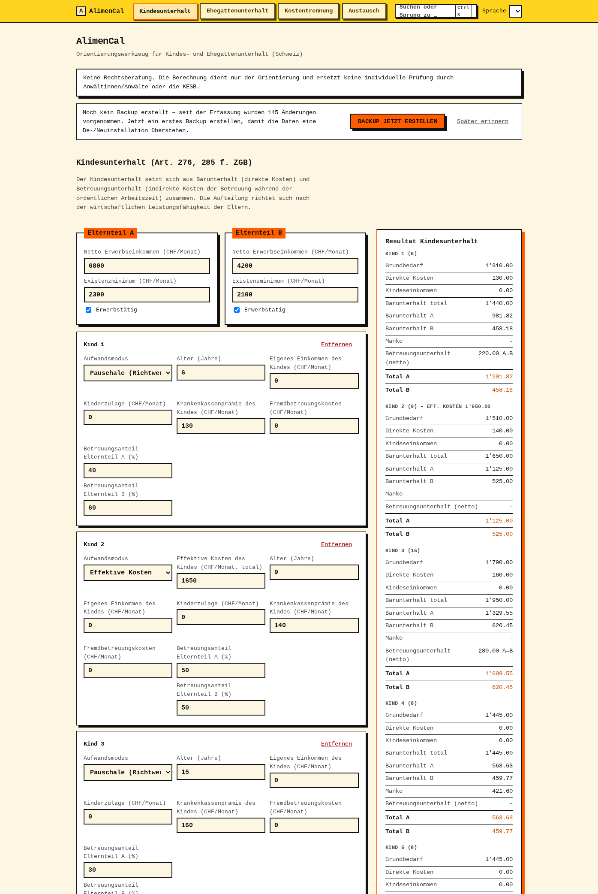 |

## Persistenz (kein Datenverlust)

Alle Eingaben werden automatisch gespeichert und nach einem Browser-Neustart
wiederhergestellt:

- Formularfelder (Einkommen, Existenzminima, Ehegattenunterhalt, Stichtag,
  Kontoinhaber)
- Kinderliste mit allen Angaben
- Kostentrennung: Transaktionen aus dem Bankexport inklusive aller Zuordnungen
  und Anteile
- Sprache, Richtwerte und gewähltes Theme

Gespeichert wird bei jeder Eingabe sowie beim Verlassen/Neuladen der Seite
(`beforeunload`, `pagehide`, `visibilitychange`).

### Lesbarkeit nach App-Updates

Die Falldaten werden in einem versionierten Format gespeichert
(`js/storage.js`). Beim Start prüft die App die Format-Version, wandelt
ältere Bestände automatisch um (Migration) und ergänzt fehlende Felder mit
Standardwerten; ungültige Einzelwerte werden verworfen, statt die gesamte
Wiederherstellung scheitern zu lassen. Dadurch bleiben alle Eingaben nach
einem App-Update lesbar – auch wenn das Speicherformat zwischen zwei Versionen
geändert wurde.

## Datenschutz

Alle Eingaben bleiben lokal im Browser (`localStorage`). Bankexporte werden
ausschliesslich im Browser geparsed – es findet kein Upload auf einen Server
statt. Die App funktioniert deshalb auch vollständig offline.

## Rechtlicher Hinweis

AlimenCal ist **keine Rechtsberatung** und ersetzt keine anwaltliche oder
behördliche Beurteilung. Die Resultate sind erste Orientierungswerte; massgebend
sind die Umstände des Einzelfalls und die Praxis der zuständigen Gerichte bzw.
der KESB. Siehe [docs/RECHTLICHE-GRUNDLAGEN.md](RECHTLICHE-GRUNDLAGEN.md).
